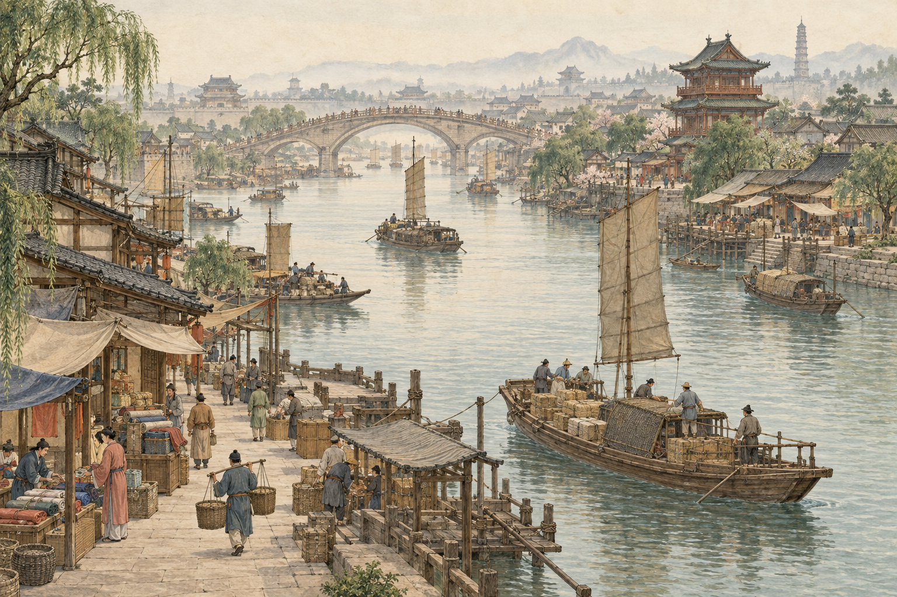
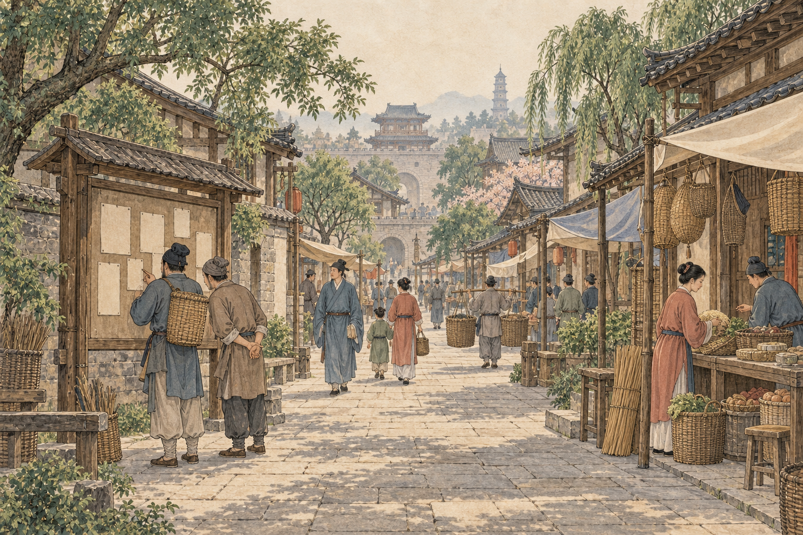
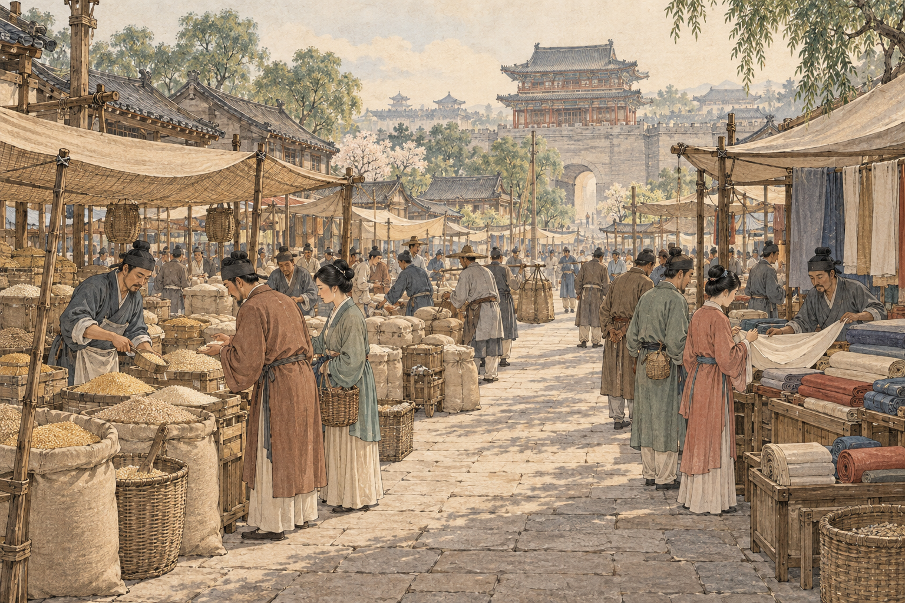
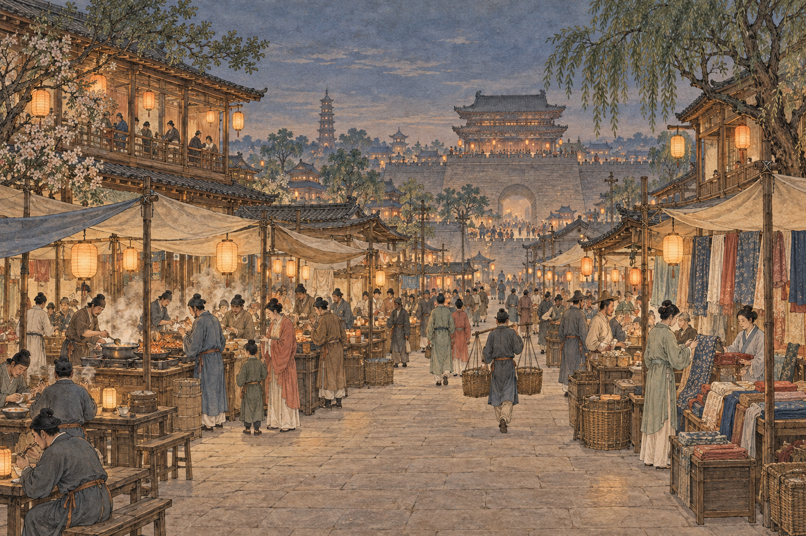
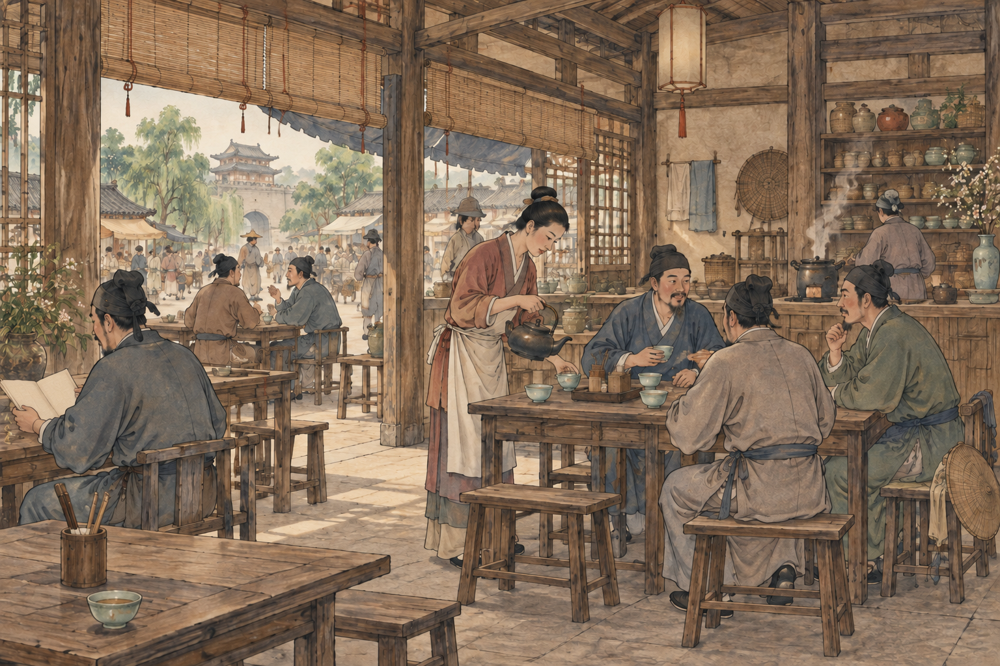
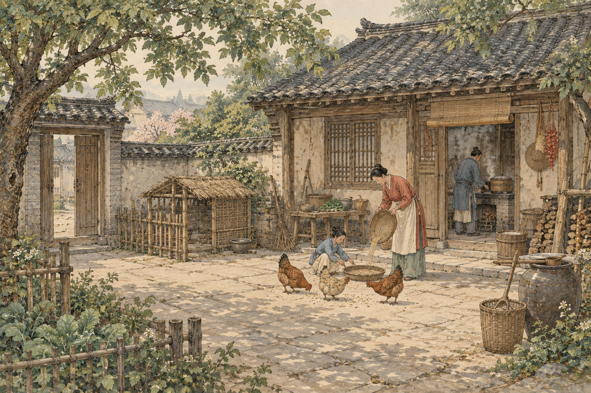

# 《汴梁归途》美术素材库

当前共 **34 张正式素材**，原图归档，界面使用独立 WebP 派生图：

- 第一批：6 张场景，1536 × 1024，见下方索引。
- 第二批：[7 张生产设备插画及预览](equipment/README.md)，1254 × 1254，存放于 `equipment/`。
- 第二批完整提示词见 [equipment/prompts.md](equipment/prompts.md)。

- 第三批：[17 类商品插画及预览](goods/README.md)，1254 × 1254；[完整提示词与来源](goods/manifest.json)。
- 第四批：[4 张住房背景及预览](scenes/README.md)，1536 × 1024；[完整提示词与来源](scenes/housing-manifest.json)。

网页派生图共 51 张：10 张场景（1440×960）、7 张设备（420×420）、17 张商品详情（420×420）及 17 张商品缩略图（96×96）。文件路径、实际尺寸、字节数和校验值见 [网页素材清单](../../public/art/manifest.json)。

以下保留第一批场景的规格与制作记录。

首批版本：v1。制作日期：2026-09-12。主视觉、街巷、市场与茶馆已接入；生活小院保留备用，实际住宅使用不含装饰鸡群的住房背景。

固定目录：`design/art-assets/`（项目根目录下）。正式原图放在 `scenes/`，完整提示词与参考关系见 [prompts.md](prompts.md)。

## 风格与规格

宋画淡彩方向：细线描、暖米白纸本、低饱和青黛与赭色，少量朱砂点缀。以北宋汴梁市井生活为设计背景，属于艺术化场景，不作为严格历史复原图。

六张均为 **1536 × 1024、3:2、PNG**。保留 imagegen 原始输出字节，未缩放或压缩。茶馆使用修正后的生成原图。全部素材由内置 imagegen 制作，其余五张以汴河主视觉作为风格参考。

## 素材索引

| 素材 | 原图 | 建议用途 |
| --- | --- | --- |
| 汴河主视觉 | [bianhe-hero-v1.png](scenes/bianhe-hero-v1.png) | 开场或主视觉 |
| 街巷 | [street-v1.png](scenes/street-v1.png) | 街巷与招工入口 |
| 早市 | [morning-market-v1.png](scenes/morning-market-v1.png) | 早市与交易场景 |
| 夜市 | [night-market-v1.png](scenes/night-market-v1.png) | 夜市与暮色场景 |
| 茶馆 | [teahouse-v1.png](scenes/teahouse-v1.png) | 茶馆与消息交流 |
| 生活小院 | [courtyard-v1.png](scenes/courtyard-v1.png) | 住宅与养鸡生活 |

## 缩略预览

预览直接引用原图，不另存缩略图。

<table>
<tr>
<td> 汴河主视觉</td>
<td> 街巷</td>
</tr>
<tr>
<td> 早市</td>
<td> 夜市</td>
</tr>
<tr>
<td> 茶馆</td>
<td> 生活小院</td>
</tr>
</table>

## 使用与版本

- 图片未嵌入界面标题、招牌文字或水印；街巷告示及茶馆书页留白，后续文字由界面承载。
- 主体集中于画面内部；横幅裁切需按实际容器检查，极宽裁切可能截去人物或摊位，优先完整 3:2 展示。
- 已另行制作适配尺寸的 WebP 派生文件，保留这里的 PNG 原图。
- 文件采用语义名称与版本号；后续修改新增 `-v2` 等版本，不覆盖 v1。
- 原始素材制作阶段仅新增素材；后续美术界面接入见 [实施清单](../../docs/plans/ART_INTERFACE_PLAN.md)。

## 验收记录

- 逐张查看完整图片，检查主体辨识度、人物与器物结构、画面文字及明显现代物品；未发现阻碍备用场景使用的明显结构缺陷。
- 对照六张的纸纹、线条、设色与人物表现；夜市采用暮色蓝与暖灯，茶馆室内与小院延续相同画风。
- 茶馆初稿书页出现细小字迹，已通过 imagegen 定向编辑去除，并复查修正图。
- 六张 PNG 均验证可解码，实际尺寸一致；归档文件与对应生成原图逐一核对 SHA-256。
- 索引及提示词中的相对路径已检查存在。原始素材归档阶段未运行游戏功能测试；当前接入验收见项目 TEST_REPORT.md。
