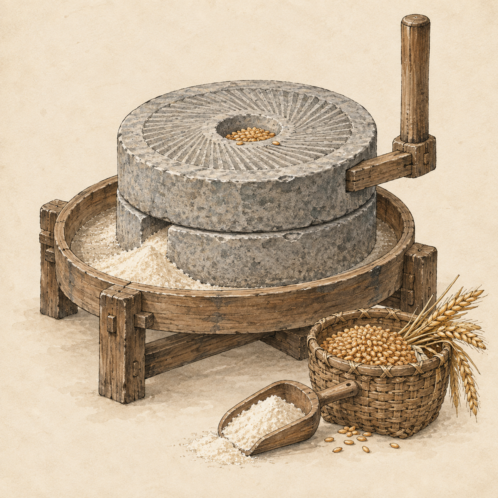
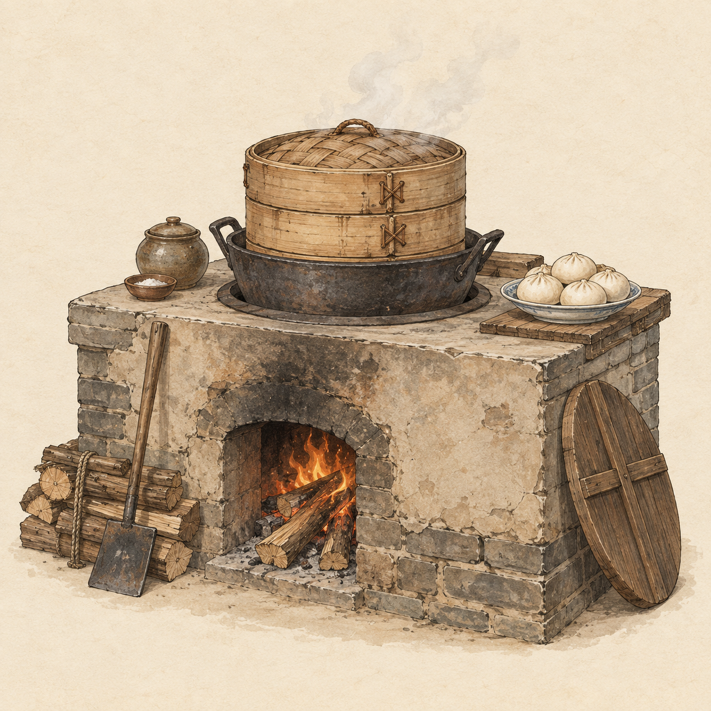
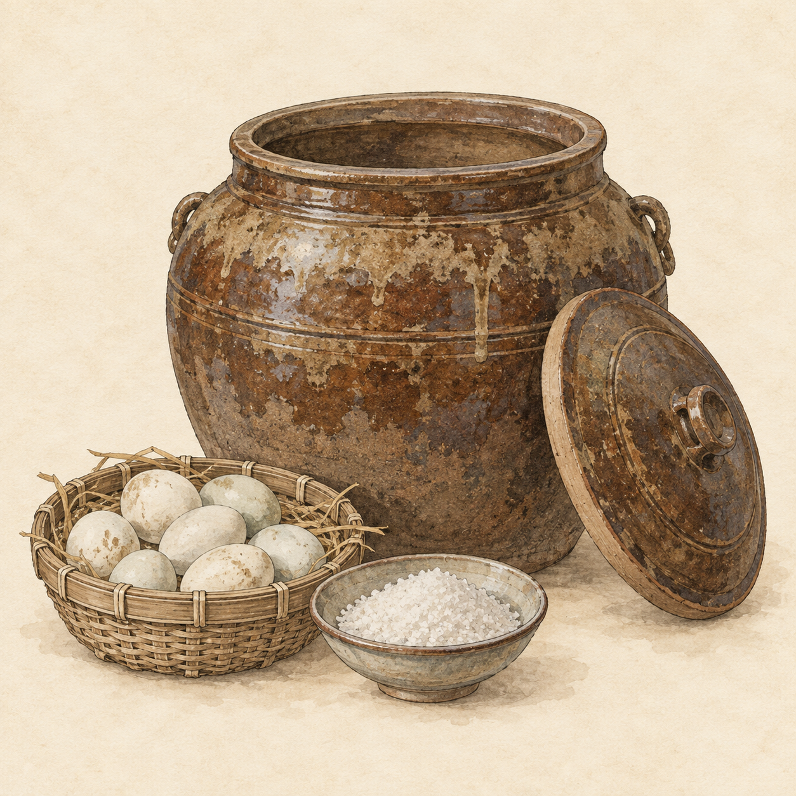
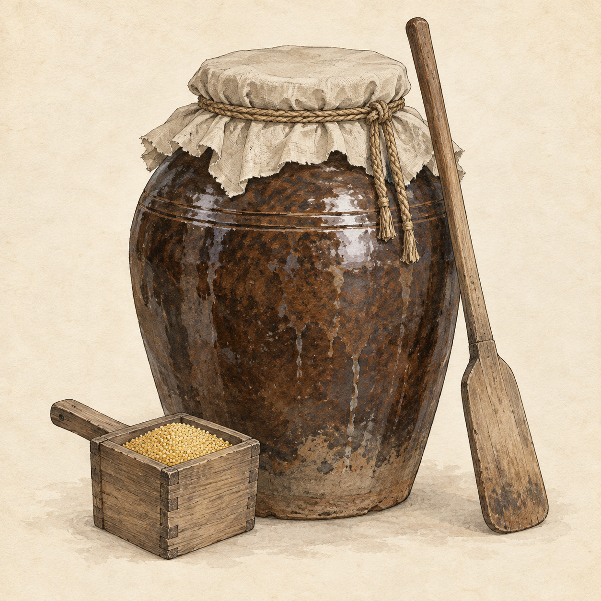
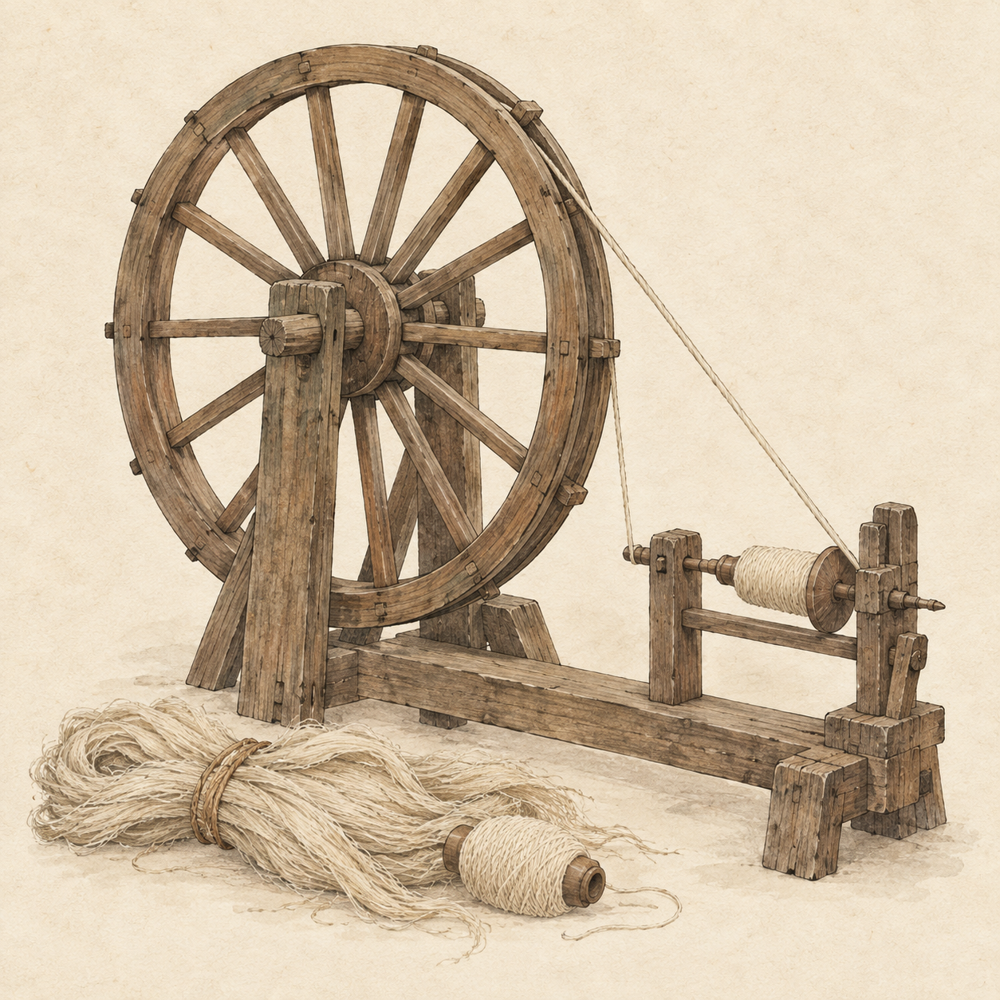
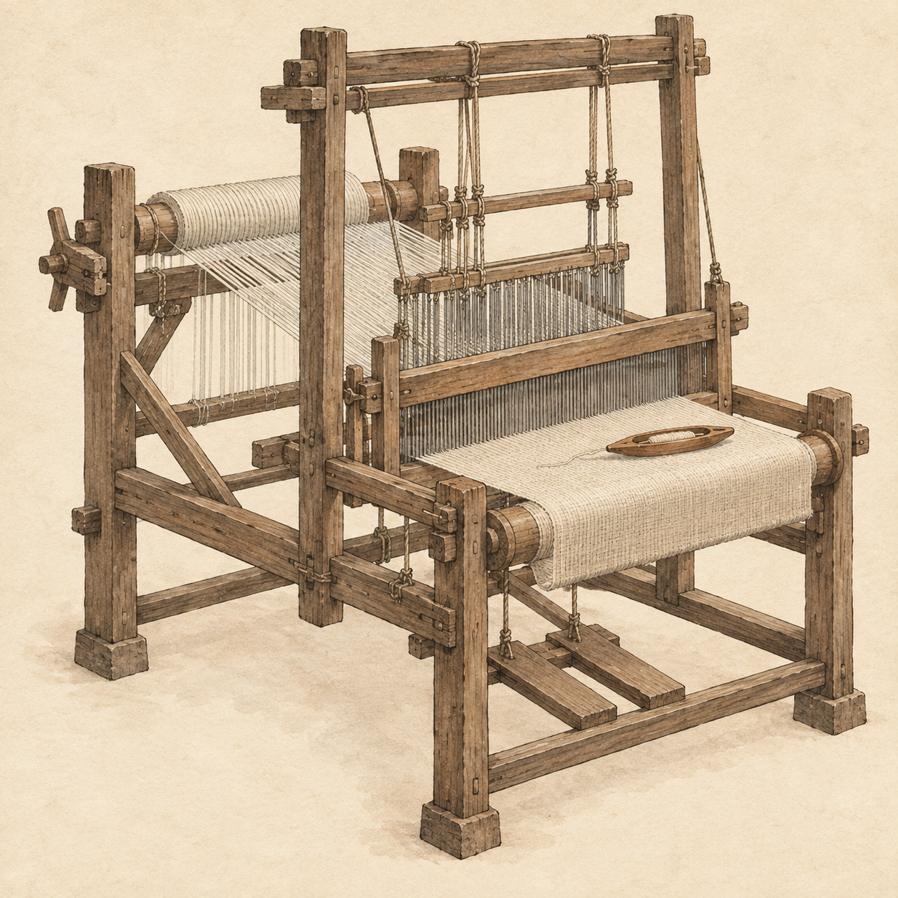
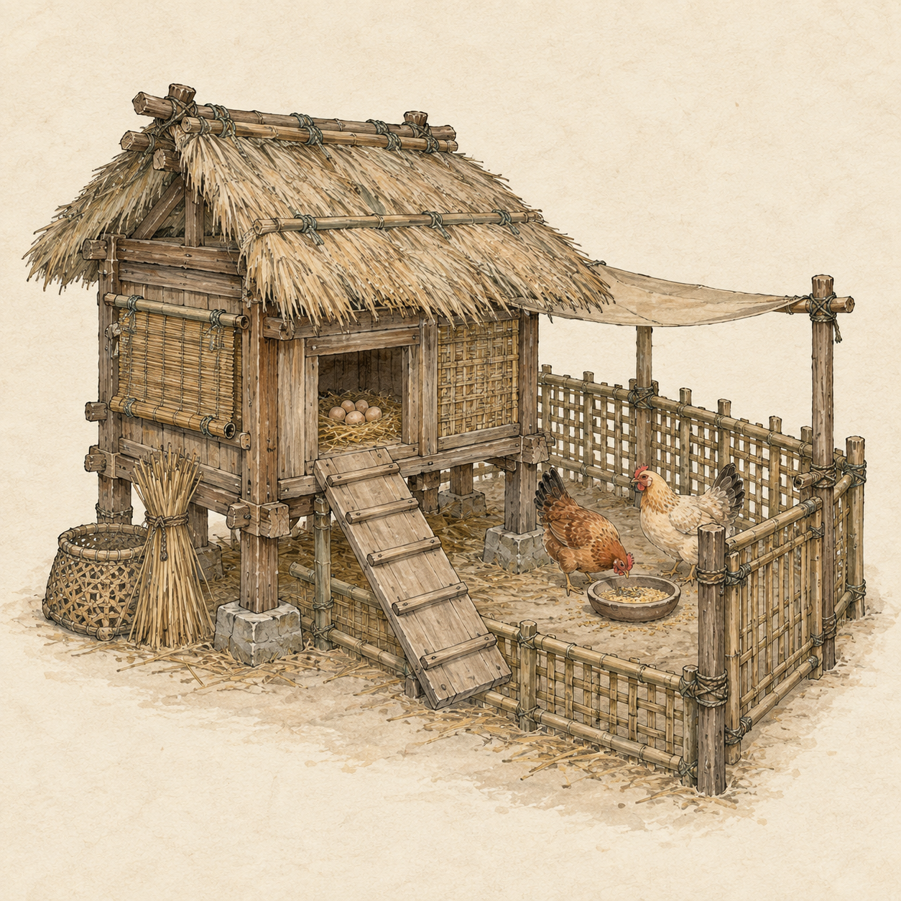

# 生产设备素材 · 第二批

状态：v1，已生成并归档备用，尚未接入游戏。使用内置 imagegen，以 [汴河主视觉](../scenes/bianhe-hero-v1.png) 作为线描、设色和纸纹参考，逐张生成。

七张实际尺寸均为 **1254 × 1254、1:1、RGB PNG**。提示词目标为 1024 × 1024，工具实际返回更高的方形尺寸；保留原图，未缩放、裁切或压缩。背景为米白纸本，非透明。

## 清单与游戏对应

| 游戏设备 ID | 名称 | 原图 | 用途 |
| --- | --- | --- | --- |
| `mill` | 石磨 | [mill-v1.png](mill-v1.png) | 磨面设备详情与卡片 |
| `stove` | 灶台 | [stove-v1.png](stove-v1.png) | 炊饼设备详情与卡片 |
| `pickleVat` | 腌缸 | [pickleVat-v1.png](pickleVat-v1.png) | 腌咸蛋设备详情与卡片 |
| `brewVat` | 酿缸 | [brewVat-v1.png](brewVat-v1.png) | 酿酒设备详情与卡片 |
| `spinningWheel` | 纺车 | [spinningWheel-v1.png](spinningWheel-v1.png) | 纺麻线设备详情与卡片 |
| `loom` | 织机 | [loom-v1.png](loom-v1.png) | 织麻布与丝绸设备详情与卡片 |
| `coop` | 鸡舍 | [coop-v1.png](coop-v1.png) | 养鸡与产蛋设备详情与卡片 |

## 预览

<table>
<tr>
<td> 石磨</td>
<td> 灶台</td>
</tr>
<tr>
<td> 腌缸</td>
<td> 酿缸</td>
</tr>
<tr>
<td> 纺车</td>
<td> 织机</td>
</tr>
<tr>
<td> 鸡舍</td>
</tr>
</table>

## 使用与检查

- 建议按完整正方形展示，避免裁掉石磨手柄、织机顶梁等靠近边缘的结构；实际留白因物件轮廓而异。
- 这些是详细物件插画，现有小尺寸 SVG 图标继续使用。后续接入时再按容器另存派生尺寸。
- 画面中的鸡、鸡蛋、原料及成品用于表达用途，不代表玩家实际数量、库存或产能。
- 腌缸采用开口宽身与鸡蛋、盐；酿缸采用高身封口与粟米，形成明确区别。
- 已逐张目视检查主体完整性、轮廓区分、纸本画风、文字及明显生成缺陷。机械结构为艺术化表现，不作为工艺复原图。
- 七张均通过完整解码、尺寸检查、源文件 SHA-256 一致性检查。与游戏当前七类设备 ID 一一对应。
- 只新增素材和文档，未改游戏代码；未运行游戏功能测试。
- 后续修订新增版本文件，不覆盖本批 v1。

完整生成提示词见 [prompts.md](prompts.md)。
