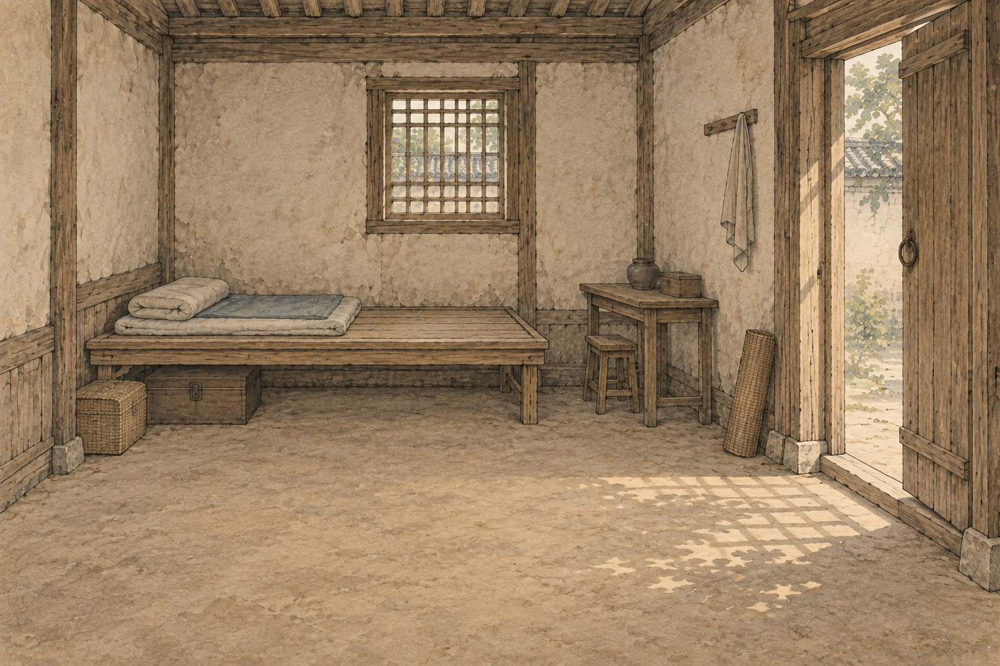
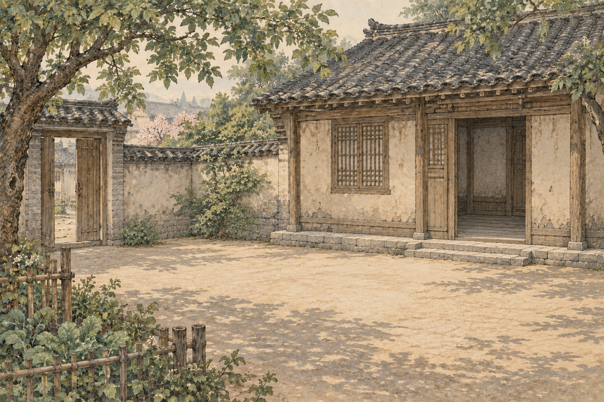
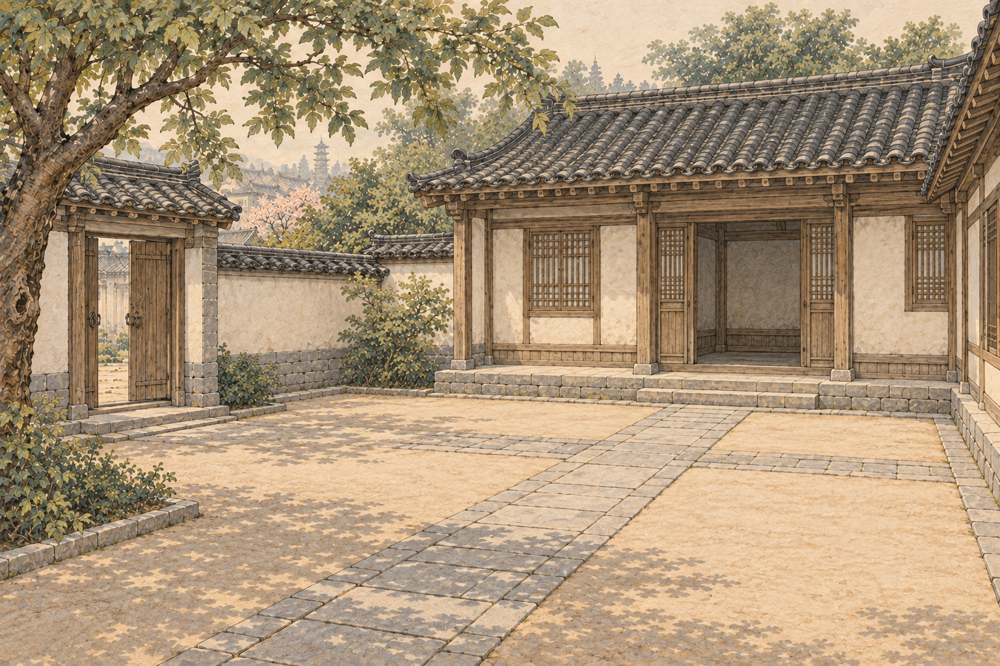
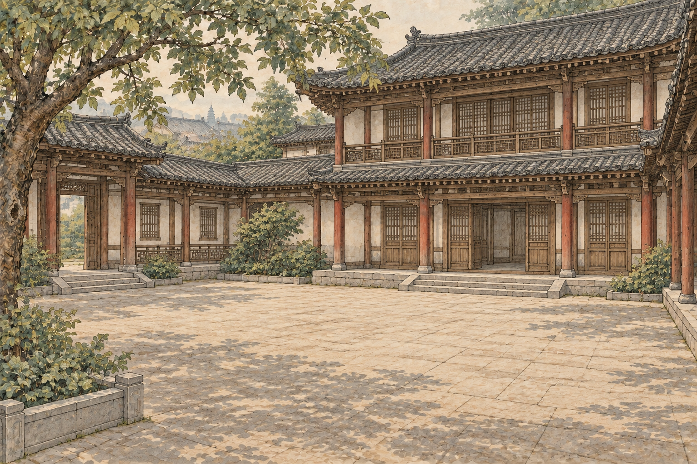

# 住房背景 · 第四批

四张均为内置 imagegen 原始 PNG，1536×1024、3:2；网页使用1440×960 WebP。保持宋画淡彩、细线描与纸本质感。原图保留，后续修订新增版本。

| 住房 | 原图预览 | 用途 |
| --- | --- | --- |
| 租住小屋 |  | room |
| 朴素空院 |  | courtyard |
| 自有院落 |  | yard |
| 自有大宅 |  | mansion |

街头居住状态继续使用 street-v1.png。背景表示住所类型，实际母鸡、已安装设备及设施由游戏数据单独显示。第一批 courtyard-v1.png 含装饰鸡群，保留备用。

完整提示词、生成原图路径与尺寸见 [housing-manifest.json](housing-manifest.json)。空院参考第一批生活小院，其余住房沿用空院风格。逐张检查建筑、器物、画风及文字，全部原图与派生图可完整解码。
